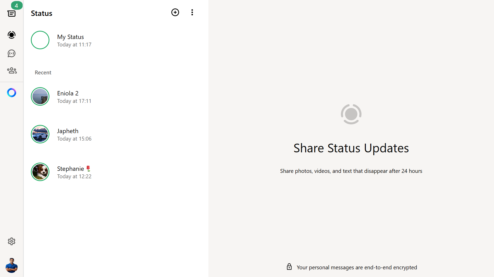

# WhatsApp Web Clone


A fully responsive **WhatsApp Web clone** built with **HTML, CSS, and JavaScript**, featuring core functionalities like messaging, chat sorting, and a status page with timed updates.

---

## 🛠️ Technologies Used
- **HTML5** – Semantic structure and layout  
- **CSS3** – Styling, responsive design, and Flexbox/Grid layout  
- **JavaScript (ES6+)** – Dynamic interactions, chat updates, filtering, and timestamps  

---

## 💡 Features
- **Send Messages** – Type and send messages with automatically updated timestamps.
- **Persistent Chats** – Messages are saved in `localStorage` so chats remain even after refreshing the page.
- **Unread Message Counter** – Tracks unread messages and updates the chat list dynamically.  
- **Sort Unread Chats** – Chats with unread messages appear at the top of the list.
- **Search & Filter Chats** – Quickly search chats by contact name or message content.  
- **Filter Recent Chats** – Quickly search and filter chats to find conversations.  
- **Status Page** – Post and view statuses that expire after a set time.  
- **Responsive Design** – Works seamlessly on desktop and mobile screens.  
- **Interactive UI** – Mimics WhatsApp Web interface for a realistic experience.  

---

## 📸 Screenshots
*(Replace with your actual screenshots or GIFs)*

- **Chat Interface:**  


- **Status Page:**  


- **Search & Filter Chats:**  

---

## 🚀 Getting Started

### 1. Clone the Repository
```bash
git clone https://github.com/your-username/whatsapp-web-clone.git
